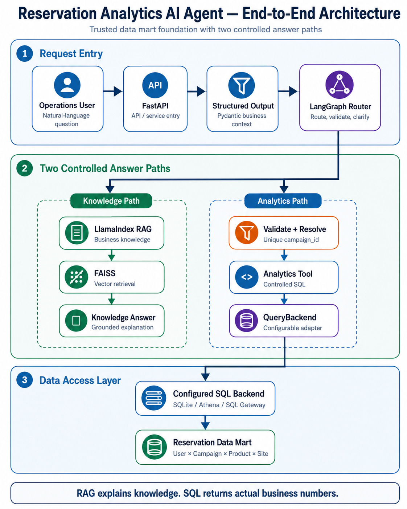
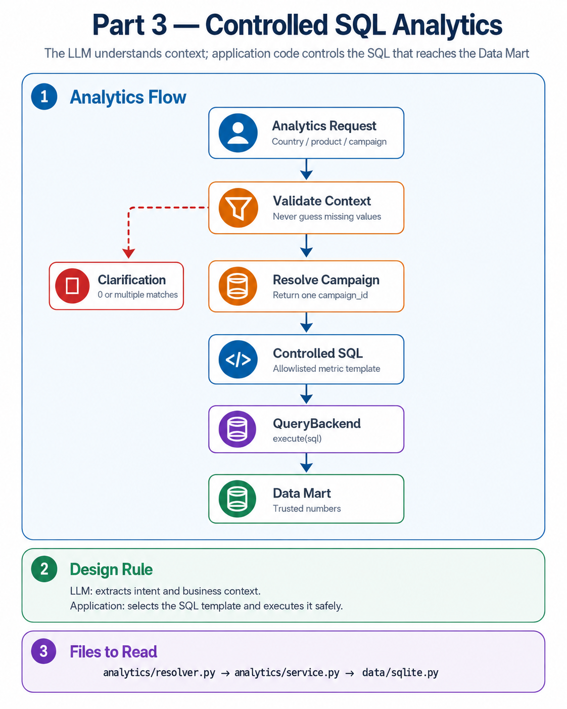

# Reservation Analytics AI Agent

> A natural-language analytics layer built on top of a trusted Reservation Data Mart.

The project keeps the learning path deliberately small:

- **LangGraph** controls routing and state.
- **LlamaIndex + FAISS** handle business knowledge retrieval.
- **Structured Output** extracts business context from natural language.
- **Controlled SQL** returns actual numbers from the Reservation Data Mart.
- **FastAPI + Docker** expose and package the service.
- **SQLite** is the default local backend; Athena and SQL Gateway are optional adapters.



## Start Here

If you want to understand the project in 1–2 days, follow this order:

1. Open **`learning/reservation_ai_learning.html`** for the audio-enabled visual guide.
2. Run **`notebooks/01_structured_output.ipynb`** through **`05_end_to_end_agent.ipynb`**.
3. Read the production code in this order:
   `models.py → extractor.py → graph.py → rag.py → resolver.py → service.py → sqlite.py`.
4. Only after the local path is clear, look at FastAPI, Docker, Athena, and SQL Gateway.

## Four Parts

| Part | Main idea | Production code | Learning notebook |
|---|---|---|---|
| **1 — Core AI** | Structured Output + LangGraph | `app/core/` | `01_structured_output.ipynb`, `03_langgraph_routing.ipynb` |
| **2 — Knowledge RAG** | LlamaIndex + FAISS | `app/knowledge/rag.py` | `02_llamaindex_faiss_rag.ipynb` |
| **3 — SQL Analytics** | Campaign resolution + controlled SQL | `app/analytics/` | `04_controlled_sql.ipynb` |
| **4 — Serving & Backends** | FastAPI, Docker, SQLite / Athena / SQL Gateway | `app/main.py`, `app/data/` | `05_end_to_end_agent.ipynb` |

## Local Quick Start

```bash
python -m venv .venv
source .venv/bin/activate
pip install -r requirements.txt
cp config/default.env .env
python run.py
```

Default mode uses SQLite and sample data, so no cloud account or internal gateway is required.

Run tests:

```bash
pytest -q
```

Run the API:

```bash
uvicorn app.main:app --reload
```

Then send:

```json
POST /ask
{
  "question": "How many users reserved Phone Mi 17 Pro in Germany for CMP001?"
}
```

## Core Request Flow

```text
Question
  ↓
Structured Output
  ↓
LangGraph
  ├── Knowledge → LlamaIndex + FAISS → Grounded Answer
  └── Analytics → Validate → Resolve campaign_id → Controlled SQL
                                                   ↓
                                               QueryBackend
                                                   ↓
                                      Reservation Data Mart
```

**Design rule:** RAG explains knowledge. SQL returns actual business numbers.

## Repository Map

```text
Reservation-Analytics-AI-Agent/
├── app/
│   ├── core/              # Part 1
│   ├── knowledge/         # Part 2
│   ├── analytics/         # Part 3
│   ├── data/              # Part 4
│   ├── settings.py
│   └── main.py
├── knowledge/
├── sample_data/
├── config/
├── notebooks/
├── docs/
│   └── architecture/
├── learning/
│   └── reservation_ai_learning.html
├── tests/
├── run.py
├── Dockerfile
└── requirements.txt
```

## Architecture

### Part 1 — Core AI


### Part 2 — LlamaIndex + FAISS


### Part 3 — Controlled SQL Analytics



### Part 4 — Serving and Data Backends


PNG is used in the README; matching SVG files are available in `docs/architecture/`.

## Sample Business Model

The Reservation Data Mart grain is:

> **User × Campaign × Product × Site**

Sample fields:

```text
user_id
campaign_id
product_id
site
reserve_flag
order_flag
reserved_not_ordered_flag
```

Sample expected result for `CMP001`:

```text
Reserved users:             8
Ordered users:              5
Reserved but not ordered:   3
Conversion rate:            62.50%
```

## Backend Switching

The upper agent logic only calls:

```python
backend.execute(sql)
```

Configuration selects the physical backend:

```text
config/default.env      → SQLite
config/aws.env          → Athena
config/internal-sg.env  → SQL Gateway / SG cluster
config/internal-eu.env  → SQL Gateway / EU cluster
```

Changing the backend does not change the LangGraph workflow, RAG path, or metric logic.
