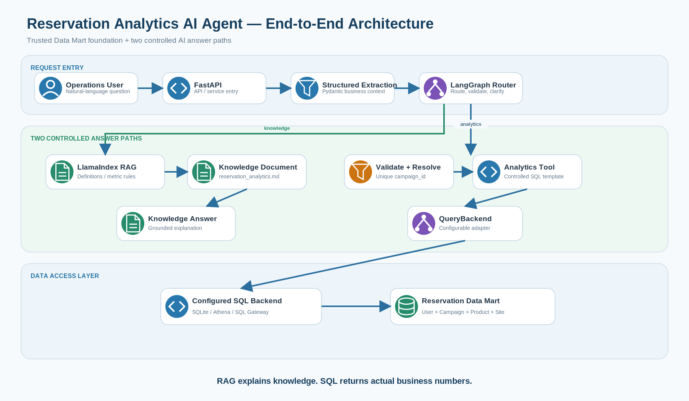
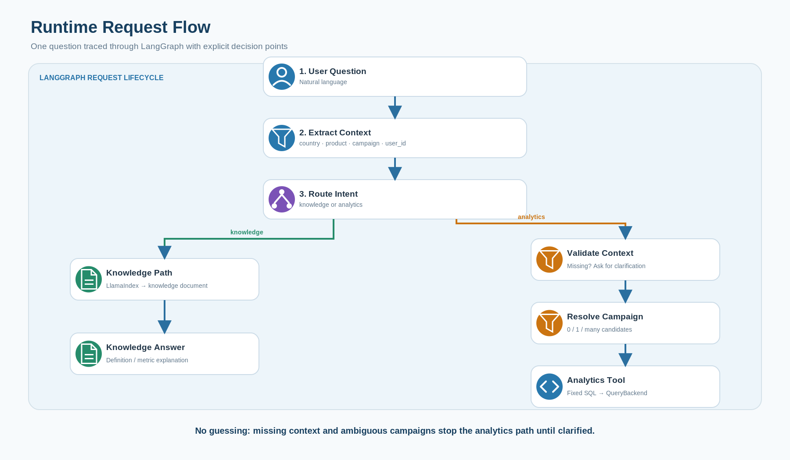
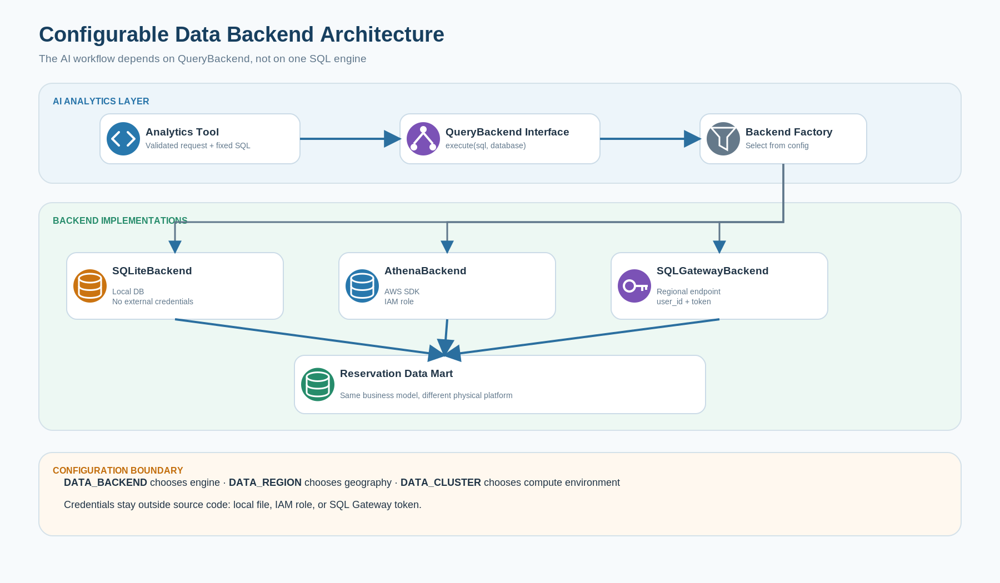
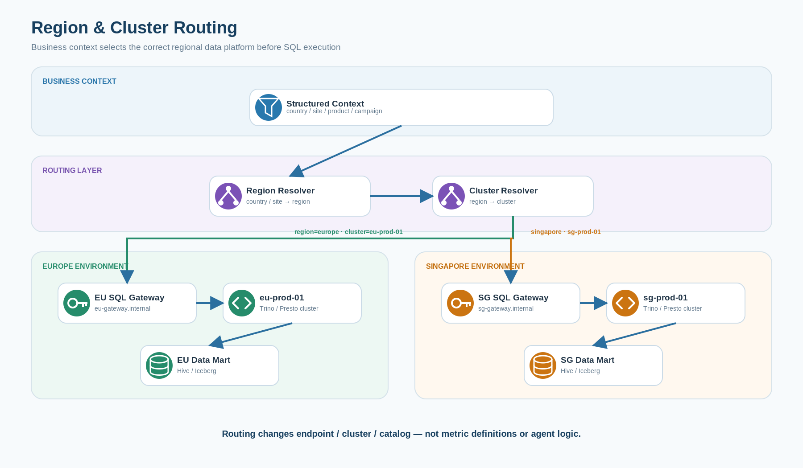

# Reservation Analytics AI Agent

> A natural-language analytics layer built on top of a trusted Reservation Data Mart.

The project separates **knowledge questions** from **data questions**:

- **LlamaIndex / RAG** explains business definitions, metric logic, and Data Mart metadata.
- **Analytics Tool / SQL** returns actual business numbers from a configurable data backend.
- **LangGraph** controls routing, validation, clarification, and state.



## 1. Start Here

If this is your first time opening the repository, follow this order:

1. Read **[Part 1 — Project Overview](docs/01_PROJECT_OVERVIEW.md)**.
2. Read **[Part 2 — Agent Workflow](docs/02_AGENT_WORKFLOW.md)**.
3. Open `app/graph.py` to see the LangGraph state machine.
4. Open `app/services/campaign_resolver.py` and `app/services/analytics.py`.
5. Read **[Part 3 — Data Backends](docs/03_DATA_BACKENDS.md)**.
6. Run `python scripts/run_demo.py`.
7. Read **[Part 4 — Code Learning Path](docs/04_CODE_LEARNING_PATH.md)** and trace one request end to end.

## 2. Business Problem

Users reserve a product before launch. The business needs to answer:

- How many users reserved?
- How many later ordered?
- Which users reserved but did not order?
- What is the reservation-to-order conversion rate?
- What do these metrics mean?

The trusted Data Mart grain is:

> **User × Campaign × Product × Site**

Core fields include `user_id`, `campaign_id`, `product_id`, `site`, `reserve_flag`, `order_flag`, and the existing `tag_reserved_not_paid` field whose business meaning here is **reserved but not ordered**.

## 3. Two Controlled Paths



### Knowledge path

```text
Question about definition / metric / Data Mart
        ↓
LangGraph
        ↓
LlamaIndex RAG
        ↓
knowledge/reservation_analytics.md
```

### Analytics path

```text
Question asking for actual numbers
        ↓
Structured extraction
        ↓
Validate required context
        ↓
Resolve one campaign_id
        ↓
Analytics Tool
        ↓
QueryBackend
        ↓
Reservation Data Mart
```

**Design rule:** RAG explains knowledge; SQL returns business numbers.

## 4. Configurable Data Backend



The AI layer is not tied to one data platform.

| Mode | Backend | Authentication | Typical use |
|---|---|---|---|
| Default | SQLite | Local file | Run the whole project locally |
| AWS | Athena | IAM role / AWS SDK | AWS-based Data Mart |
| Internal | SQL Gateway | `user_id` + token | Hive / Iceberg / Trino platform |

Region and cluster routing are described in **[Part 3 — Data Backends](docs/03_DATA_BACKENDS.md)**.



## 5. Run Locally

```bash
python -m venv .venv
source .venv/bin/activate
pip install -r requirements.txt
cp config/default.env .env
python scripts/run_demo.py
```

Default mode uses SQLite and automatically builds:

```text
local_data/reservation_analytics.db
```

from the sample DIM and DM CSV files, so no AWS account or internal SQL Gateway is required.

Run tests:

```bash
pytest -q
```

Run API:

```bash
uvicorn app.main:app --reload
```

## 6. Repository Map

```text
Reservation-Analytics-AI-Agent/
├── app/
│   ├── graph.py                 # LangGraph workflow
│   ├── agent_service.py         # high-level service entry
│   ├── schemas.py               # structured state / request models
│   └── services/
│       ├── extractor.py         # natural language → structured context
│       ├── knowledge.py         # LlamaIndex knowledge retrieval
│       ├── campaign_resolver.py # context → unique campaign_id
│       ├── analytics.py         # controlled SQL templates
│       ├── query_backend.py     # backend interface
│       ├── backend_factory.py   # backend selection
│       ├── sqlite_backend.py    # local runnable backend
│       ├── athena.py            # AWS backend
│       └── sql_gateway.py       # internal platform backend
├── knowledge/
│   └── reservation_analytics.md
├── mock_data/
│   ├── dim_campaign.csv
│   └── dm_reservation_conversion.csv
├── config/
│   ├── default.env
│   ├── aws-athena.env
│   ├── internal-sg.env
│   └── internal-eu.env
├── docs/
│   ├── 01_PROJECT_OVERVIEW.md
│   ├── 02_AGENT_WORKFLOW.md
│   ├── 03_DATA_BACKENDS.md
│   ├── 04_CODE_LEARNING_PATH.md
│   └── architecture/
└── scripts/run_demo.py
```

## 7. Documentation Parts

| Part | Read this when you want to understand... |
|---|---|
| [Part 1](docs/01_PROJECT_OVERVIEW.md) | business problem, Data Mart, and overall architecture |
| [Part 2](docs/02_AGENT_WORKFLOW.md) | LangGraph, LlamaIndex, validation, campaign resolution, SQL tool flow |
| [Part 3](docs/03_DATA_BACKENDS.md) | SQLite, Athena, internal SQL Gateway, region and cluster routing |
| [Part 4](docs/04_CODE_LEARNING_PATH.md) | exactly which source files to read and in what order |
| [Architecture Assets](docs/architecture/README.md) | PNG/SVG diagrams and what each diagram explains |

## 8. Core Design Principles

- Keep the **trusted Data Mart** separate from the AI application.
- Never let the LLM invent a `campaign_id`.
- Ask for clarification when business context is missing or ambiguous.
- Do not let the LLM generate unrestricted production SQL.
- Keep the data backend behind a configurable adapter.
- Keep credentials outside source code.
- Route regional workloads to the correct region / cluster.
