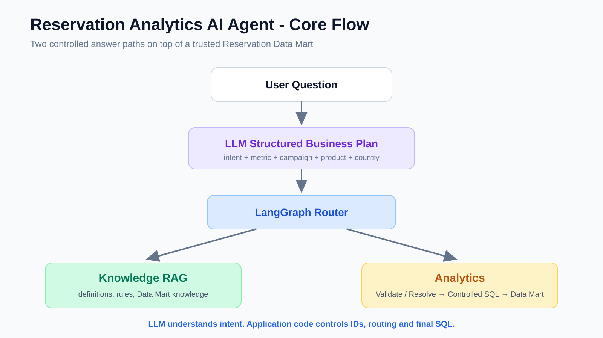
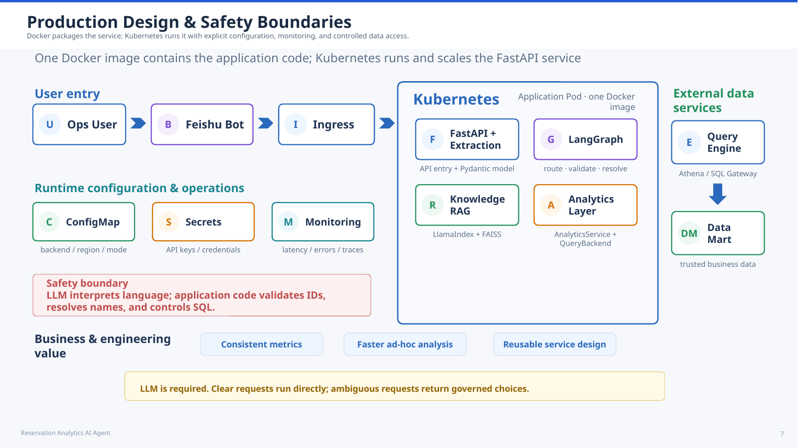

# Reservation Analytics AI Agent

> A natural-language knowledge and analytics layer built on a trusted Reservation Data Mart.

- **LangGraph** routes each request to the Knowledge or Analytics path.
- **LlamaIndex + FAISS** provide RAG for business definitions, metric rules, and Data Mart knowledge.
- **Structured Output** converts the user question into a typed business plan.
- **Entity Resolution** validates stable IDs directly and resolves natural-language names only when needed.
- **Controlled SQL** returns trusted aggregate metrics or detail records from the Reservation Data Mart.
- **FastAPI + Docker** serve and package the application.
- **SQLite** supports local demos; remote query backends can be added through the QueryBackend interface.

### 30-Second Mental Model

```text
LangGraph routes the request.
RAG explains knowledge.
Analytics returns trusted numbers.
The LLM understands intent; application code controls SQL.
```



## Core Flow

```text
User Question
    ↓
LLM Structured Business Plan
    ↓
LangGraph Router
   ↙                 ↘
Knowledge RAG       Analytics
                        ↓
              Validate / Resolve
              ID → exact validation
              Name → resolve if needed
                        ↓
                 Controlled SQL
                        ↓
                   QueryBackend
                        ↓
              Reservation Data Mart
                        ↓
                      Answer
```

## RAG Flow

```text
Knowledge .md Files
        ↓
ingestion
Load files as LlamaIndex Document objects
        ↓
embeddings
Convert text chunks into numeric vectors
        ↓
vectorstore
Store vectors in FAISS IndexFlatL2
        ↓
retrieval
Embed the user query and retrieve Top-K relevant chunks
        ↓
service.py
Give retrieved context + question to the LLM
        ↓
Grounded Knowledge Answer
```

### RAG Components

```text
rag/
├── ingestion/      Load knowledge files
├── embeddings/     Convert text into vectors
├── vectorstore/    Store/search vectors with FAISS
├── retrieval/      Retrieve Top-K chunks and build the query engine
└── service.py      Provide the final RAG answer interface
```

### RAG Mental Model

```text
File
  ↓
Document object
  ↓
Chunks
  ↓
Embeddings
  ↓
FAISS

User Question
  ↓
Query Embedding
  ↓
Top-K Similar Chunks
  ↓
LLM + Retrieved Context
  ↓
Answer
```

## Analytics Flow

```text
Structured Business Plan
        ↓
validation
Check that enough business context exists
        ↓
resolution
Stable ID → exact validation
Natural-language name → governed lookup
        ↓
metrics
Choose an allowlisted business metric
        ↓
query
Build and execute controlled SQL
        ↓
QueryBackend
SQLite / remote query backend / SQL Gateway
        ↓
Reservation Data Mart
        ↓
service.py
Return trusted business results
```

### Analytics Components

```text
analytics/
├── models/         Structured requests, contexts, and results
├── validation/     Check required business context
├── resolution/     Convert names to governed IDs / validate stable IDs
├── metrics/        Allowlisted metric definitions and SQL builders
├── query/          QueryBackend abstraction and implementations
└── service.py      Execute the selected trusted metric
```

## Application Structure

```text
app/
├── rag/            Knowledge retrieval
├── analytics/      Trusted business analytics
├── graph/          LangGraph orchestration
├── api/            FastAPI interface
├── llm/            Shared structured-output LLM client
├── settings.py     Runtime configuration
└── main.py         Application entry point
```

## Read the Code in This Order

```text
1. app/graph/workflow.py
   Understand the full route first.

2. app/graph/nodes/extract.py
   See how the LLM creates the structured business plan.

3. app/rag/service.py
   See the knowledge path entry point.

4. app/rag/ingestion/loader.py
   File → Document objects.

5. app/rag/embeddings/embedder.py
   Text → vectors.

6. app/rag/vectorstore/faiss_store.py
   Vectors → FAISS IndexFlatL2.

7. app/rag/retrieval/retriever.py
   Top-K retrieval → grounded LLM answer.

8. app/analytics/resolution/service.py
   Stable IDs vs natural-language names.

9. app/analytics/metrics/reservation.py
   Controlled metric SQL.

10. app/analytics/service.py
    Execute SQL and return trusted results.
```

## Key Design Rules

```text
Stable ID supplied
    → validate directly
    → do not ask the LLM to resolve it again

Natural-language name supplied
    → lookup governed candidates
    → resolve only when needed

Knowledge question
    → RAG

Business-number question
    → controlled SQL

LLM
    → understands intent
    → does NOT generate the final analytics SQL
```

## Example Walkthroughs

### Example 1 - Knowledge Question

```text
User: "What does reserved_users mean?"
        ↓
Structured Business Plan: route = knowledge
        ↓
LangGraph → Knowledge RAG
        ↓
Top-K chunks from metric knowledge
        ↓
LLM grounded answer
```

### Example 2 - Analytics Question

```text
User: "For campaign CMP001 in Germany, how many users reserved Phone Mi 17 Pro?"
        ↓
Structured Business Plan
metric = reserved_users
campaign_id = CMP001
country = Germany
product = Phone Mi 17 Pro
        ↓
CMP001 → exact validation
Germany / Phone Mi 17 Pro → governed name resolution
        ↓
Allowlisted reserved_users SQL
        ↓
Reservation Data Mart
        ↓
Answer: 8 reserved users
```

## Data Model

```text
dm_reservation_subject_df
Grain: User × Campaign × Product × Country
```

Dimensions: `dim_campaign_df`, `dim_product_df`, `dim_category_df`, `dim_site_df`.

Detail responses expose `fuser_id_hash`, not raw `fuser_id`.


## Production Design & Safety Boundaries



```text
FastAPI Service
      ↓
Docker Image
      ↓
Kubernetes Runtime
      ↓
Controlled Query Layer
      ↓
Reservation Data Mart
```

Safety boundaries: governed IDs, allowlisted controlled SQL, configuration/secrets outside application code, monitoring, and privacy-safe detail output.

## Local Run

```bash
python -m venv .venv
source .venv/bin/activate
pip install -r requirements.txt
cp .env.example .env
pytest -q
uvicorn app.main:app --reload
```

## Learning-Friendly Code Comments

The main Python modules contain detailed docstrings and inline comments so the code can be read as an learning guide. For the fastest walkthrough, use [`docs/07_CODE_READING_GUIDE.md`](docs/07_CODE_READING_GUIDE.md).

