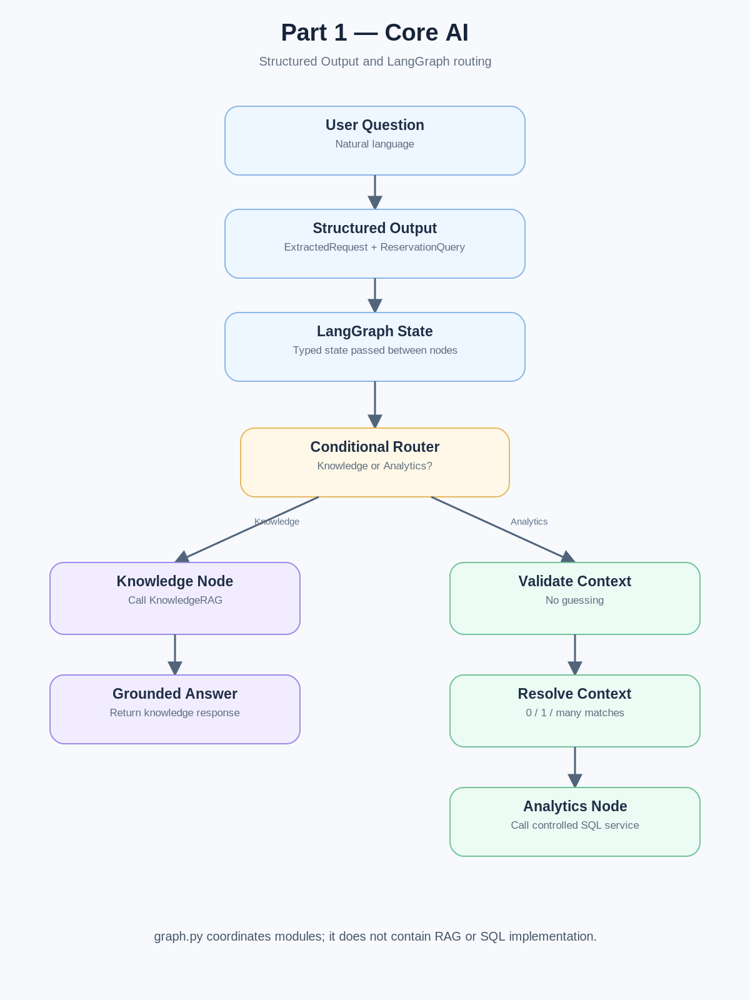

# Part 1 — Core AI



## Goal

Understand how a natural-language request becomes structured business context and then moves through LangGraph.

## Read in This Order

```text
app/core/models.py
      ↓
app/core/extractor.py
      ↓
app/core/graph.py
```

## Concepts

- **Pydantic Structured Output** converts free text into `ReservationQuery`.
- **LangGraph State** stores the request as it moves between nodes.
- **Conditional edges** route Knowledge questions to RAG and Analytics questions to validation.
- Missing business context produces clarification instead of guessed values.

## Keep This Mental Model

```text
Question → Extract → Route
                    ├─ Knowledge
                    └─ Analytics
```

The graph does not contain SQL implementation or FAISS implementation. It only coordinates them.
