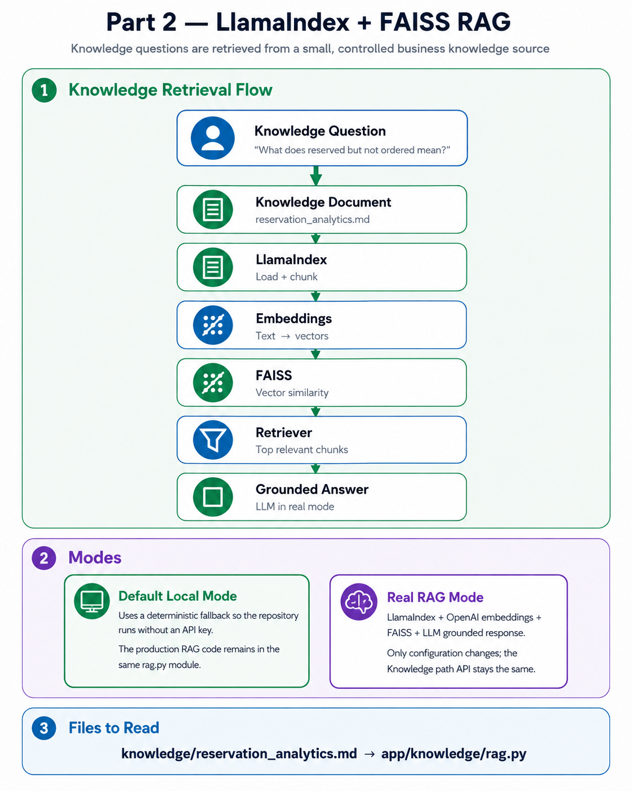

# Part 2 — Knowledge RAG



## Goal

Answer metric-definition and data-model questions from controlled Markdown knowledge.

## Read in This Order

```text
knowledge/kg_reservation_metrics.md
knowledge/kg_data_model.md
        ↓
app/rag/ingestion/loader.py
        ↓
app/rag/embeddings/embedder.py
        ↓
app/rag/vectorstore/faiss_store.py
        ↓
app/rag/retrieval/retriever.py
        ↓
app/rag/service.py
```

## Flow

```text
Markdown Knowledge → chunks → embeddings → FAISS → Top-K → grounded answer
```

RAG answers knowledge questions only. Actual business numbers come from the controlled analytics path.
