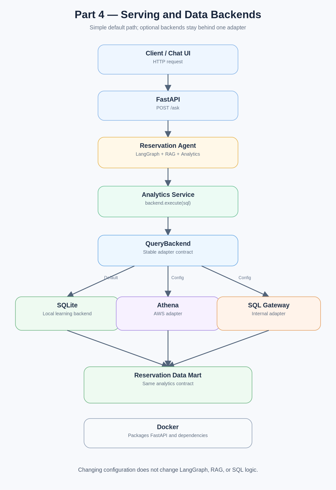

# Part 4 — Serving and Data Backends



## Goal

Keep serving and physical data access separate from the Core AI workflow.

## FastAPI

`app/main.py` exposes two small endpoints and keeps the HTTP layer thin:

```text
GET  /health
POST /ask
```

`POST /ask` accepts `question` plus an optional `session_id`. If the caller omits the ID, the API generates one and returns it. A clarification follow-up must reuse the same ID. Feishu can derive a stable key from `chat_id + thread/root_message_id + user_id` to isolate concurrent users.

## Docker

The Dockerfile packages Python, FastAPI, LangGraph, LlamaIndex, FAISS, and the analytics code into one runnable service.

## Backend Contract

The upper analytics layer only needs:

```python
backend.execute(sql)
```

Implementations:

```text
SQLiteBackend      → local default
AthenaBackend      → AWS SDK + IAM
SQLGatewayBackend  → endpoint + user_id + token
```

Region and cluster values are configuration only. They do not change the agent workflow.

## Configuration Files

```text
config/local.env
config/aws.env
config/internal.env
```

The three files share common keys. Real secrets are read from root `.env`; see `config/README.md`.
