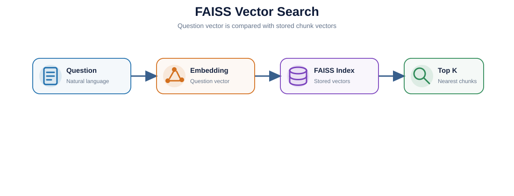
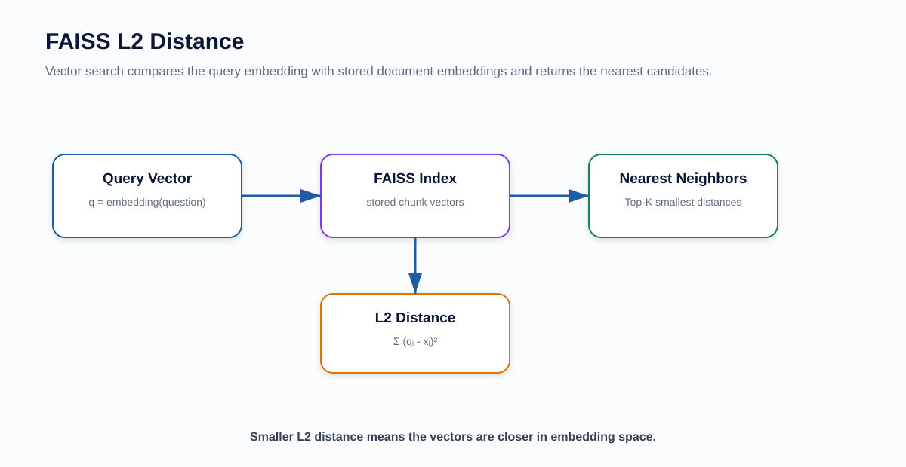
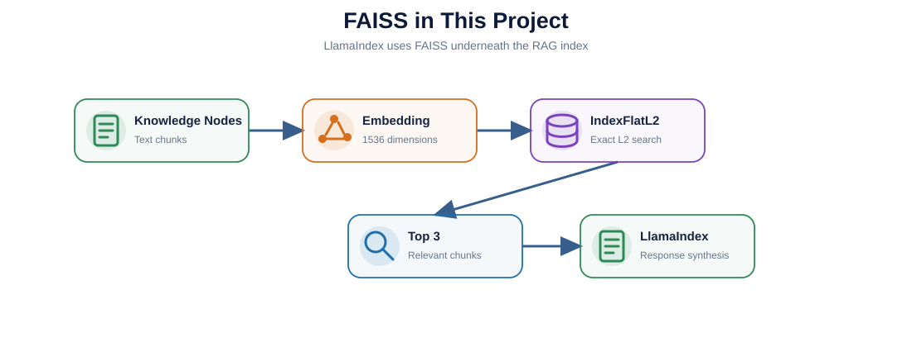

# FAISS Learning — Project-Focused Deep Dive

> Notebook: `faiss_project_learning.ipynb`

FAISS is the **vector similarity-search engine** underneath this project's LlamaIndex RAG path.

---

## 1. What You Will Learn

- what vector search is;
- embeddings;
- embedding dimensions;
- nearest neighbors;
- L2 / Euclidean distance;
- cosine similarity;
- inner product;
- `IndexFlatL2`;
- `add()`;
- `search()`;
- Top K;
- exact vs approximate nearest-neighbor search;
- FAISS persistence;
- IVF / HNSW / PQ concepts;
- FAISS vs a vector database;
- exactly how LlamaIndex uses FAISS here.

---

## 2. Architecture







---

## 3. What FAISS Does

FAISS answers:

> Which stored vectors are nearest to this query vector?

It does **not**:

- understand Markdown;
- chunk documents;
- know business definitions;
- call the LLM;
- write the final answer.

Those higher-level responsibilities belong to LlamaIndex.

---

## 4. Current Project Configuration

```python
faiss.IndexFlatL2(1536)
```

Meaning:

```text
IndexFlat
→ exact search across stored vectors

L2
→ Euclidean-distance metric

1536
→ vector dimension
```

The dimension must match the embedding model.

Current embedding model:

```text
text-embedding-3-small
```

---

## 5. Vector Search Mental Model

```text
Question
   ↓
Embedding model
   ↓
Query vector
   ↓
FAISS
   ↓
Compare against stored chunk vectors
   ↓
Nearest K vectors
   ↓
Relevant knowledge chunks
```

---

## 6. IndexFlatL2

Advantages:

- easy to understand;
- no training stage;
- exact search;
- appropriate for small datasets.

Tradeoffs:

- scans all stored vectors;
- memory grows with vector count;
- may not be the best approach for very large indexes.

---

## 7. L2 Distance

With L2:

```text
smaller distance = closer vector
```

Do not confuse it with a similarity score where larger means better.

---

## 8. L2 vs Cosine

### L2

Euclidean distance.

### Cosine

Compares direction / angle.

### Inner Product

Dot-product-based ranking.

The choice should match your embedding and vector-store design.

Do not switch metrics casually.

---

## 9. Top K

Current RAG setting:

```python
similarity_top_k=3
```

This ultimately asks the vector retrieval layer to return several nearby chunks.

```text
Top 3
≠ three answers
≠ voting

Top 3
= three evidence chunks
```

---

## 10. FAISS vs Vector Database

FAISS is primarily a **library**.

A managed vector database may additionally provide:

- persistent storage;
- replication;
- metadata filtering;
- authentication;
- distributed scaling;
- APIs;
- operations / monitoring.

FAISS can still be an excellent embedded/local retrieval engine.

---

## 11. Scaling Concepts

You do not need to implement these in the project now, but understand the names:

### IVF

Partition the vector space and search selected partitions.

### HNSW

Graph-based approximate nearest neighbor.

### PQ

Vector compression to reduce memory.

Tradeoff:

```text
Exact search
↔
speed / memory / recall
```

---

## 12. Project-Level Q&A

### Q1. Is FAISS an LLM?

No. It is a vector similarity-search library.

### Q2. Is FAISS the RAG system?

No. It is one component of the RAG system.

### Q3. Why dimension 1536?

Because the configured embedding model outputs vectors with that dimension.

### Q4. Why Top 3?

It is a small, understandable balance between context coverage and noise/token cost.

### Q5. FAISS vs LlamaIndex?

FAISS finds nearest vectors. LlamaIndex manages documents, indexes, retrieval and LLM response synthesis.

---

## 13. After You Finish

You should be able to say:

> In this project, LlamaIndex manages the RAG workflow and uses FAISS as the vector store. Markdown chunks are embedded into 1536-dimensional vectors, FAISS performs L2 nearest-neighbor search, and the top retrieved chunks are sent to the LLM as evidence.

Next:

```text
../llamaindex/
```

---

## Classic Architecture Q&A

### Q. Why do you use LangChain selectively instead of making it the entire application framework?

> I use LangChain selectively rather than making it the entire application framework. LangChain's ChatOpenAI integration handles structured extraction, LangGraph handles stateful workflow orchestration, and LlamaIndex with FAISS handles the knowledge RAG layer. This keeps responsibilities explicit and prevents the LLM from directly controlling analytics SQL.


### How to remember it

```text
LangChain / ChatOpenAI
→ Structured Extraction

Pydantic
→ Typed Contract

LangGraph
→ Stateful Workflow Orchestration

LlamaIndex + FAISS
→ Knowledge RAG

Controlled Python / SQL
→ Trusted Analytics

FastAPI
→ HTTP Serving
```

### Key design principle

> **Use the best-fitting abstraction for each responsibility instead of forcing every layer into one framework.**

This answer is useful when explaining:

- why the project uses several AI libraries;
- why LangChain is present but not dominant;
- why LangGraph controls routing;
- why LlamaIndex + FAISS own the knowledge path;
- why analytics SQL remains application-controlled.
