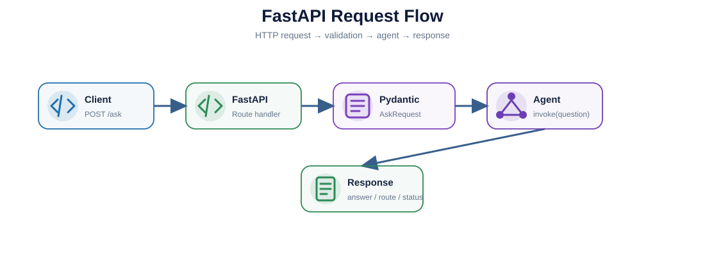
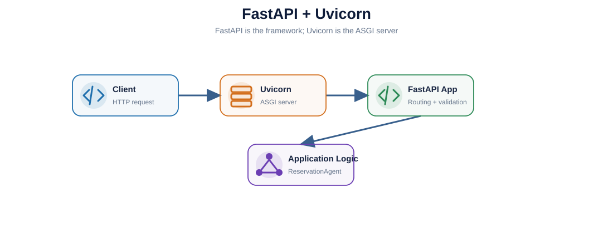
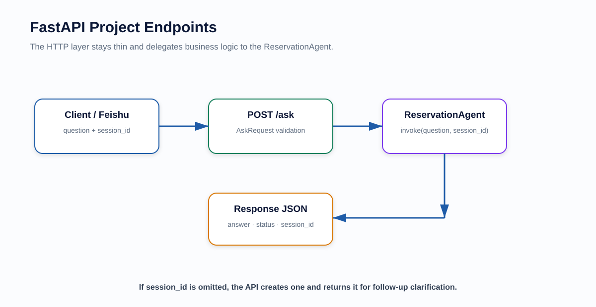

# FastAPI Learning — Project-Focused Deep Dive

> Notebook: `fastapi_project_learning.ipynb`

This folder explains how the Reservation Analytics AI Agent becomes an **HTTP service**.

---

## 1. What You Will Learn

- what FastAPI is;
- FastAPI vs Flask;
- FastAPI vs Uvicorn;
- ASGI;
- routes;
- HTTP methods;
- request body;
- Pydantic request models;
- response models;
- sync vs async;
- dependency injection;
- errors / `HTTPException`;
- middleware;
- CORS;
- application lifespan;
- testing with `TestClient`;
- Docker serving;
- exactly where FastAPI sits in this project.

---

## 2. Architecture







---

## 3. Where FastAPI Is Used

Current code:

```text
app/main.py
```

Flow:

```text
HTTP Client
    ↓
FastAPI
    ↓
AskRequest
    ↓
ReservationAgent.invoke()
    ↓
LangGraph
    ↓
RAG or Analytics
    ↓
JSON response
```

FastAPI does **not** perform routing itself.

It is the service boundary.

---

## 4. Current Endpoints

### Health

```http
GET /health
```

Purpose:

- verify service is alive;
- expose basic backend/config status.

### Ask

```http
POST /ask
```

Request:

```json
{
  "question": "How many users reserved Phone Mi 17 Pro in Germany for CMP001?"
}
```

Response shape:

```json
{
  "answer": "...",
  "route": "analytics",
  "status": "answered"
}
```

---

## 5. FastAPI vs Uvicorn

### FastAPI

Application framework.

It defines:

- routes;
- validation;
- request handling;
- response handling;
- OpenAPI docs.

### Uvicorn

ASGI server.

Command:

```bash
uvicorn app.main:app --reload
```

Meaning:

```text
uvicorn
  ↓
import app.main
  ↓
find variable app
  ↓
serve FastAPI application
```

---

## 6. FastAPI vs Flask

| FastAPI | Flask |
|---|---|
| Modern type-driven API framework | Lightweight general web framework |
| Native Pydantic integration | Validation usually added separately |
| Automatic OpenAPI docs | Extensions/manual configuration |
| ASGI / async-friendly | Historically WSGI-centric |
| Great for typed APIs | Great for simple/general Python web apps |

Neither is universally “better”; they optimize for different development styles.

---

## 7. Current Code Pattern

```python
class AskRequest(BaseModel):
    question: str


@app.post("/ask")
def ask(request: AskRequest) -> dict:
    result = agent.invoke(request.question)

    return {
        "answer": result.get("answer", ""),
        "route": result.get("route", ""),
        "status": result.get("status", ""),
    }
```

Pydantic validates the incoming request before your application logic uses it.

---

## 8. Sync vs Async

FastAPI supports:

```python
def ask(...):
    ...
```

and:

```python
async def ask(...):
    ...
```

Important:

> Declaring `async` does not magically turn blocking code into non-blocking code.

Choose based on the actual I/O libraries in the call stack.

---

## 9. Production Improvements

Useful future improvements:

- response models;
- dependency injection;
- authentication / authorization;
- request IDs;
- structured logging;
- tracing;
- timeouts;
- rate limiting;
- CORS policy;
- lifespan initialization;
- health / readiness distinction;
- metrics;
- API versioning.

---

## 10. Project-Level Q&A

### Q1. What does FastAPI do in this project?

It exposes the agent through HTTP. It receives a typed request, calls the agent and returns the workflow result.

### Q2. FastAPI vs LangGraph?

FastAPI is the external HTTP interface. LangGraph controls the internal workflow.

### Q3. FastAPI vs Uvicorn?

FastAPI is the framework; Uvicorn runs it as an ASGI server.

### Q4. Why Pydantic with FastAPI?

Pydantic provides request/response schema validation and type-driven API contracts.

### Q5. Would you make `/ask` async?

Only if the underlying model/database clients and call path are appropriately asynchronous.

---

## 11. After You Finish

You should be able to describe:

> FastAPI is the serving layer. It accepts the natural-language question over HTTP, validates the request with Pydantic, invokes the ReservationAgent and returns the final route/status/answer as JSON.

Next:

```text
../pydantic/
../langgraph/
```

---

## Classic Architecture Q&A

### Q. Why do you use LangChain selectively instead of making it the entire application framework?

> I use LangChain selectively rather than making it the entire application framework. LangChain's ChatOpenAI integration handles structured extraction, LangGraph handles stateful workflow orchestration, and LlamaIndex with FAISS handles the knowledge RAG layer. This keeps responsibilities explicit and prevents the LLM from directly controlling analytics SQL.


### How to remember it

```text
LangChain / ChatOpenAI
→ Structured Extraction

Pydantic
→ Typed Contract

LangGraph
→ Stateful Workflow Orchestration

LlamaIndex + FAISS
→ Knowledge RAG

Controlled Python / SQL
→ Trusted Analytics

FastAPI
→ HTTP Serving
```

### Key design principle

> **Use the best-fitting abstraction for each responsibility instead of forcing every layer into one framework.**

This answer is useful when explaining:

- why the project uses several AI libraries;
- why LangChain is present but not dominant;
- why LangGraph controls routing;
- why LlamaIndex + FAISS own the knowledge path;
- why analytics SQL remains application-controlled.
