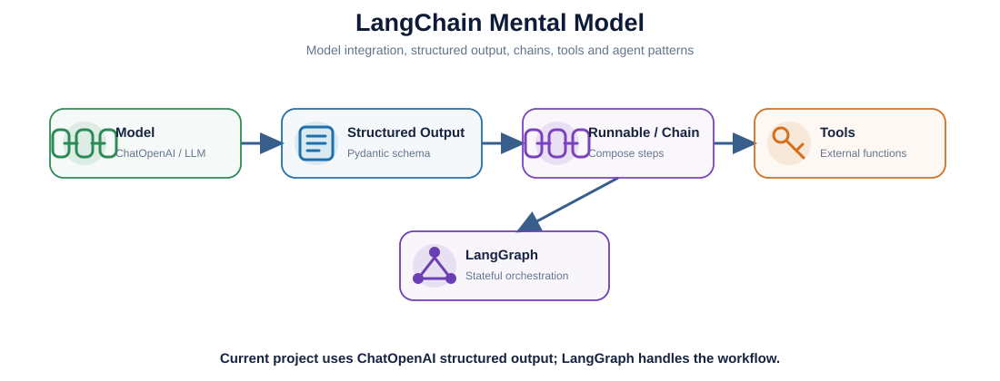
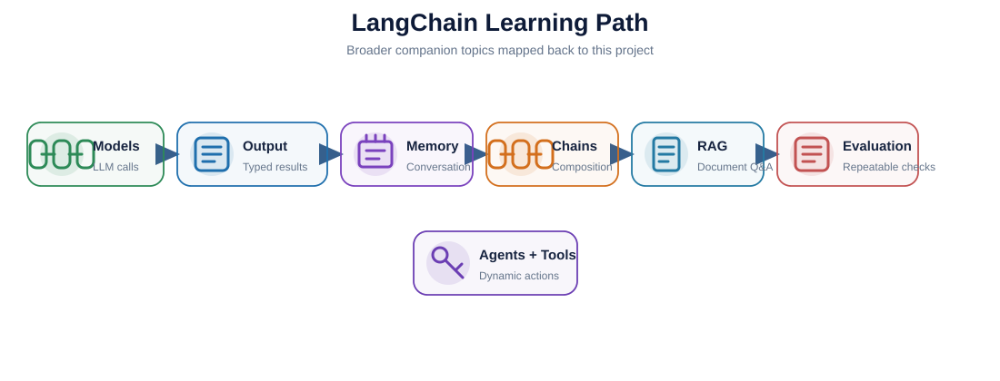
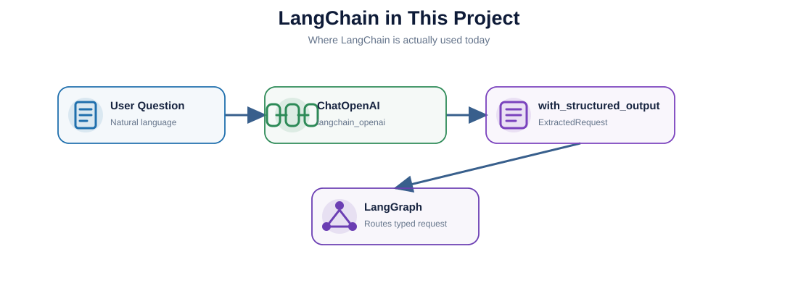

# LangChain Learning — Project-Focused Deep Dive

> Notebook: `langchain_project_learning.ipynb`

This folder explains **LangChain fundamentals** and then maps them directly to the current Reservation Analytics AI Agent.

The project does use a LangChain component:

```python
from langchain_openai import ChatOpenAI

llm = ChatOpenAI(...).with_structured_output(ExtractedRequest)
```

But LangChain is **not the main orchestration framework** and **not the RAG framework** in this project.

---

## 1. What You Will Learn

By the end of this notebook you should be able to explain:

- what LangChain is;
- `ChatOpenAI`;
- Prompt templates;
- Structured Output;
- `with_structured_output()`;
- Runnable / LCEL;
- Chains;
- Memory concepts;
- Document Q&A / RAG concepts;
- Evaluation;
- Agents and Tools;
- Tool Calling;
- the difference between a deterministic chain and an agent;
- the difference between LangChain, LangGraph and LlamaIndex;
- exactly where LangChain appears in this project.

The content follows the broader learning path from the earlier LangChain course companion:

```text
Models & Structured Output
        ↓
Memory
        ↓
Chains
        ↓
Document Q&A / RAG
        ↓
Evaluation
        ↓
Agents & Tools
```

---

## 2. Visual Learning Map







---

## 3. Where LangChain Is Used in This Project

Current code:

```text
app/core/extractor.py
```

Responsibility:

```text
Natural-language question
        ↓
ChatOpenAI
        ↓
with_structured_output(ExtractedRequest)
        ↓
Pydantic object
        ↓
LangGraph
```

Example:

```python
llm = ChatOpenAI(
    model=settings.openai_model,
    api_key=settings.openai_api_key,
    temperature=0,
).with_structured_output(ExtractedRequest)
```

LangChain is therefore used for the **LLM structured-extraction layer**.

---

## 4. What LangChain Does NOT Do Here

The project intentionally separates responsibilities:

| Technology | Responsibility |
|---|---|
| **LangChain / ChatOpenAI** | Structured LLM extraction |
| **Pydantic** | Typed schemas and validation |
| **LangGraph** | State, routing and workflow |
| **LlamaIndex** | Knowledge RAG |
| **FAISS** | Vector similarity search |
| **FastAPI** | HTTP serving |
| **Python + controlled SQL** | Analytics execution |

This is important because a project does **not** need to use every LangChain abstraction.

For example, the current project does not need to build its RAG path with LangChain retriever chains because LlamaIndex already owns that responsibility.

---

## 5. Why Not Use LangChain for Everything?

You *could* implement more of the system with LangChain, but that would not automatically make the architecture better.

This project keeps each responsibility explicit:

```text
LLM extraction
    → LangChain

Workflow
    → LangGraph

Knowledge RAG
    → LlamaIndex + FAISS

Business numbers
    → controlled SQL

Serving
    → FastAPI
```

Benefits:

- easier to explain;
- less framework coupling;
- easier to test each layer;
- no unrestricted LLM-generated SQL;
- easier to replace one component later.

---

## 6. Notebook Sections

The notebook covers:

1. What LangChain is
2. Models / `ChatOpenAI`
3. Prompts
4. Structured Output
5. Runnable and LCEL
6. Memory
7. Chains
8. Document Q&A / RAG
9. Evaluation
10. Agents and Tools
11. LangChain vs LangGraph vs LlamaIndex
12. Project mapping
13. Q&A

---

## 7. Key Code to Know

### Basic model

```python
from langchain_openai import ChatOpenAI

llm = ChatOpenAI(
    model="gpt-4.1-mini",
    temperature=0,
)
```

### Structured Output

```python
llm = ChatOpenAI(...).with_structured_output(
    ExtractedRequest
)

request = llm.invoke(question)
```

### Runnable mental model

```text
Prompt
  ↓
Model
  ↓
Parser / Structured Output
```

or with LCEL:

```python
chain = prompt | llm
result = chain.invoke({"question": question})
```

---

## 8. Concepts to Remember

### Chain

A mostly predefined sequence of steps.

```text
Prompt → Model → Output
```

### Agent

The model can dynamically choose an action/tool.

```text
Question
   ↓
LLM decides
   ↓
Tool A / Tool B / Tool C
```

### Current Project

The project deliberately uses more deterministic control:

```text
LLM extracts context
        ↓
LangGraph decides workflow
        ↓
Application calls RAG or analytics
```

The LLM does not get unrestricted database-tool access.

---

## 9. Project-Level Q&A

### Q1. Does this project use LangChain?

Yes. `app/core/extractor.py` uses `langchain_openai.ChatOpenAI` and `with_structured_output()`.

### Q2. Why did you not build the whole project with LangChain?

Because LangGraph is better suited to explicit stateful workflow routing, while LlamaIndex provides a concise RAG layer. The project uses the best-fitting abstraction for each responsibility rather than forcing everything into one framework.

### Q3. Why use LangGraph if LangChain has agents?

The workflow is controlled and business-rule driven. LangGraph makes states, nodes, validation and conditional routing explicit.

### Q4. Why use LlamaIndex rather than a LangChain retriever chain?

LlamaIndex provides a focused, concise abstraction for loading knowledge, indexing it, retrieving nodes and synthesizing answers. The project keeps RAG independent from workflow orchestration.

### Q5. Could the project remove LangChain completely?

Yes. Structured extraction could be implemented directly with an OpenAI SDK call plus Pydantic-compatible parsing. But `ChatOpenAI.with_structured_output()` is convenient and clear, so it is a reasonable dependency.

---

## 10. After You Finish

You should be able to answer:

> “Where does LangChain fit into this architecture?”

Strong answer:

> LangChain is used mainly for the LLM integration and structured extraction layer. I use `ChatOpenAI.with_structured_output()` to convert a natural-language request into a typed Pydantic object. LangGraph then controls the workflow, while LlamaIndex and FAISS handle knowledge retrieval.

Next:

```text
../pydantic/
../langgraph/
../llamaindex/
```

---

## Classic Architecture Q&A

### Q. Why do you use LangChain selectively instead of making it the entire application framework?

> I use LangChain selectively rather than making it the entire application framework. LangChain's ChatOpenAI integration handles structured extraction, LangGraph handles stateful workflow orchestration, and LlamaIndex with FAISS handles the knowledge RAG layer. This keeps responsibilities explicit and prevents the LLM from directly controlling analytics SQL.


### How to remember it

```text
LangChain / ChatOpenAI
→ Structured Extraction

Pydantic
→ Typed Contract

LangGraph
→ Stateful Workflow Orchestration

LlamaIndex + FAISS
→ Knowledge RAG

Controlled Python / SQL
→ Trusted Analytics

FastAPI
→ HTTP Serving
```

### Key design principle

> **Use the best-fitting abstraction for each responsibility instead of forcing every layer into one framework.**

This answer is useful when explaining:

- why the project uses several AI libraries;
- why LangChain is present but not dominant;
- why LangGraph controls routing;
- why LlamaIndex + FAISS own the knowledge path;
- why analytics SQL remains application-controlled.
