# LangGraph Learning Guide for the Reservation Analytics AI Agent

This folder is a project-focused introduction to LangGraph. It is designed to explain the concepts needed to understand a reservation analytics agent built from an extractor, RAG, business-context validation, campaign resolution, and an analytics service.

## Project workflow

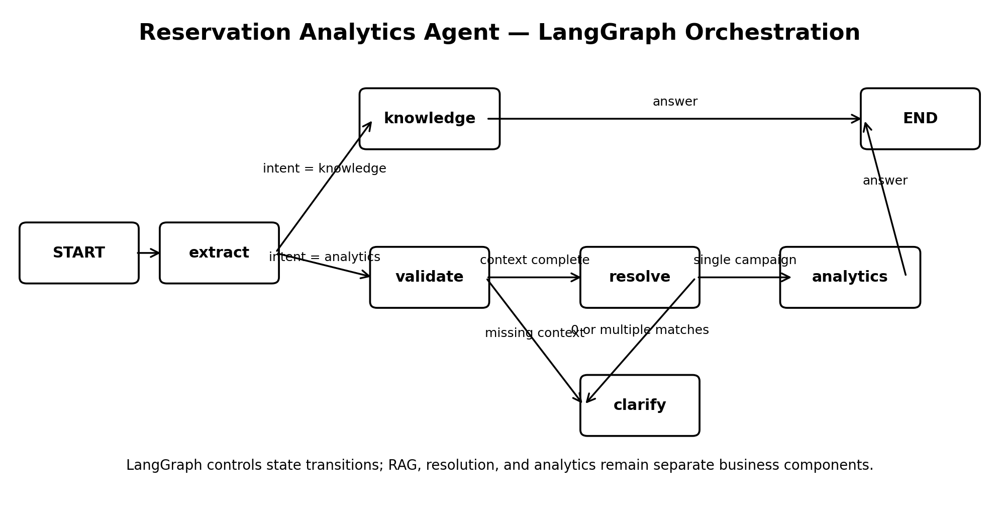

The key idea is simple:

> **LangGraph is the orchestration layer.** It controls state transitions and routing. It does not replace the LLM extractor, RAG system, entity resolver, or analytics backend.

The project has two main execution paths:

```text
Knowledge question:
START -> extract -> knowledge/RAG -> END

Analytics question:
START -> extract -> validate -> resolve -> analytics -> END
```

If required context is missing, or campaign resolution is ambiguous, execution stops and asks for clarification instead of guessing.

---

## 1. State

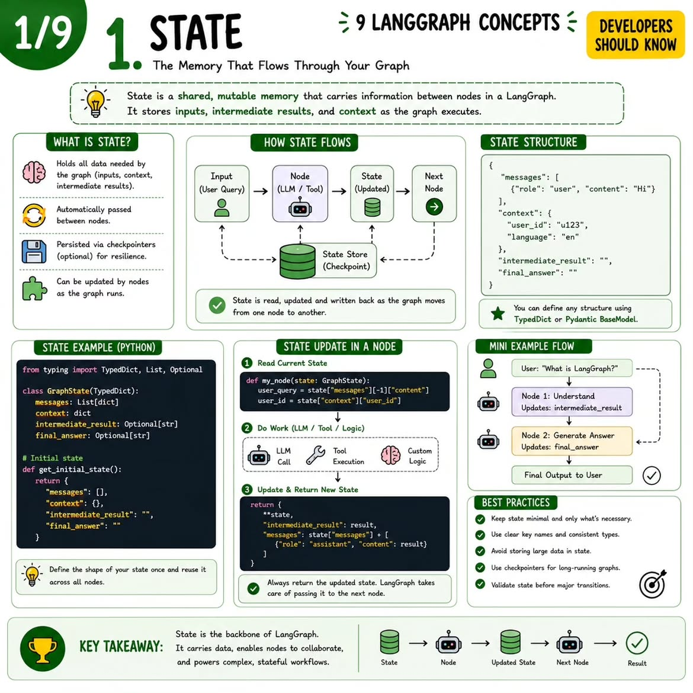

**State** is the shared working context that moves through the graph. Nodes read fields from the state and return updates.

Typical project fields include:

```python
question
intent
metric
query
resolved_context
status
answer
```

This keeps node interfaces simple and makes workflow context explicit.

---

## 2. Nodes

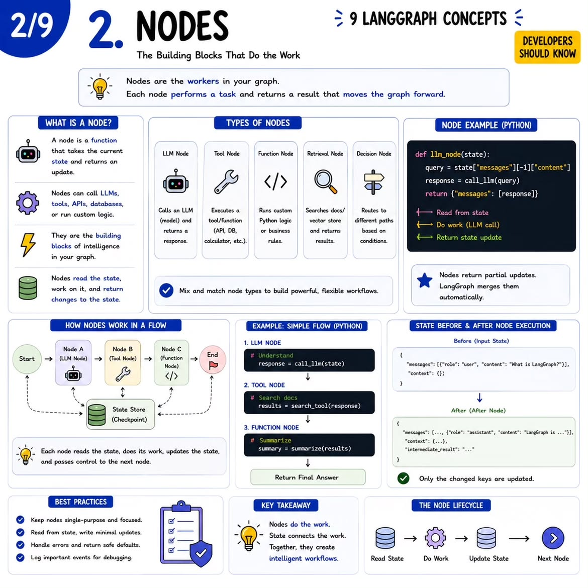

A **node** is one processing step, usually a Python callable.

Project mapping:

| Node | Responsibility |
|---|---|
| `extract` | Convert a user question into a structured request. |
| `knowledge` | Answer business-definition questions with RAG. |
| `validate` | Check whether required business context is present. |
| `resolve` | Resolve the request to one trusted campaign. |
| `analytics` | Run the requested metric against the analytics backend. |

LangGraph decides when a node runs; the node contains or calls the business logic.

---

## 3. Edges

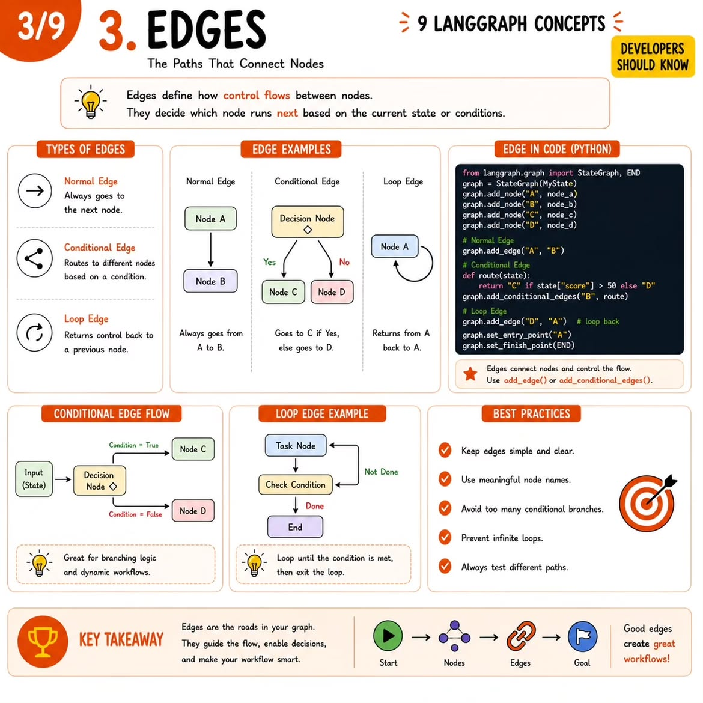

An **edge** defines a deterministic transition between nodes.

```python
graph.add_edge(START, "extract")
graph.add_edge("knowledge", END)
graph.add_edge("analytics", END)
```

`START` and `END` are graph control markers.

---

## 4. Conditional edges

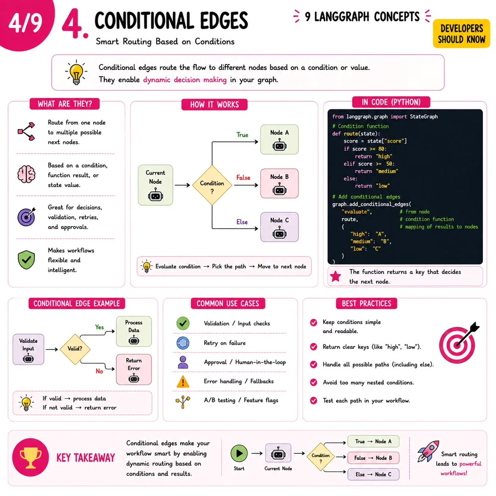

A **conditional edge** chooses the next node based on the current state.

The project uses this pattern three times:

```text
_after_extract  -> knowledge or validate
_after_validate -> resolve or end
_after_resolve  -> analytics or end
```

This is the main reason LangGraph is useful here: routing and stopping rules are visible in the graph instead of being hidden inside a large agent prompt.

---

## 5. Build, compile, and invoke

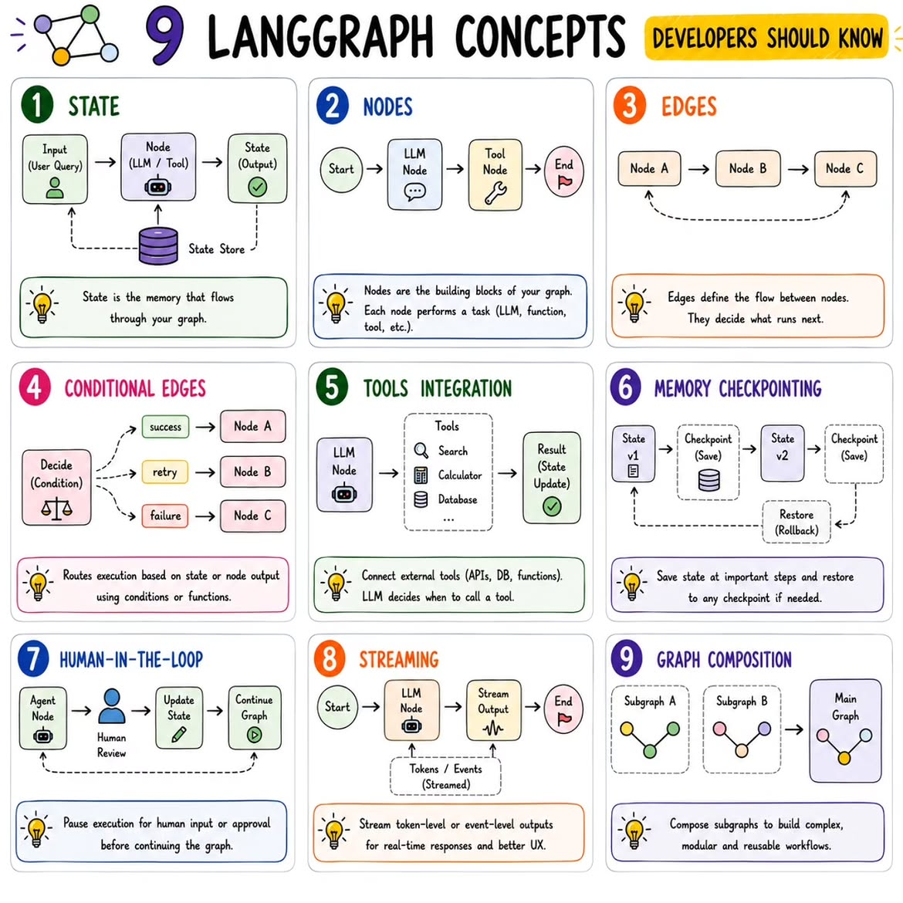

The core lifecycle is:

```text
State schema
 -> StateGraph
 -> add_node()
 -> add_edge() / add_conditional_edges()
 -> compile()
 -> invoke(initial_state)
```

`compile()` creates an executable graph. `invoke()` runs it from the supplied initial state until execution reaches `END`.

---

## 6. Why validation and resolution matter

For analytics questions, the graph does not jump directly from natural language to a query.

```text
Natural language
 -> Structured request
 -> Validation
 -> Campaign resolution
 -> Trusted analytics service
 -> Answer
```

This design reduces accidental guessing. Missing context causes a clarification. Multiple matching campaigns also cause a clarification. Only one resolved campaign proceeds to the analytics layer.

---

## 7. Tools integration — learn later

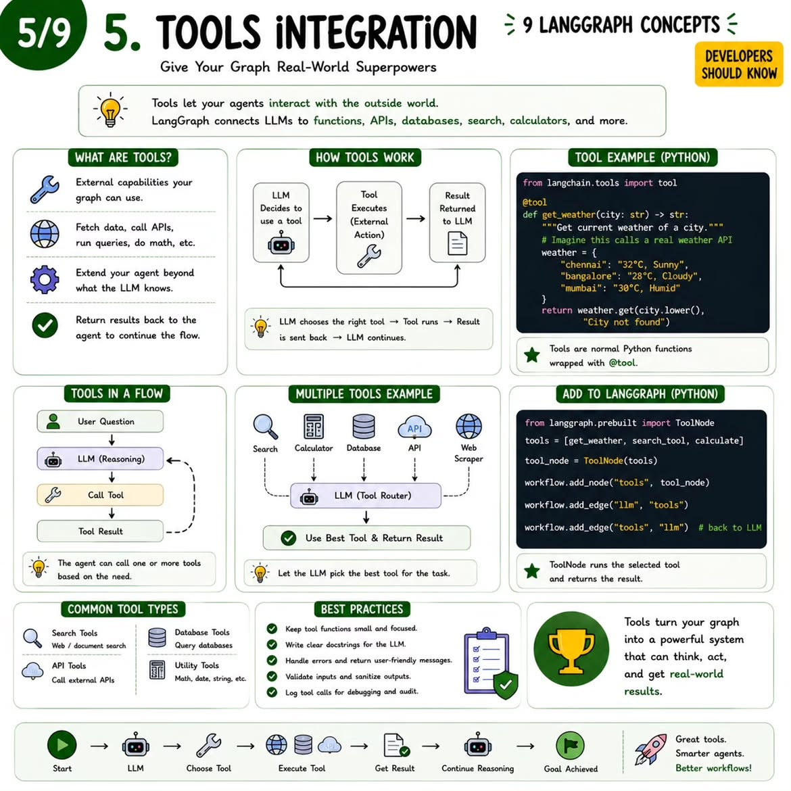

LangGraph can orchestrate generic LLM tools. In this project, components such as RAG, campaign resolution, and analytics are currently called directly from graph nodes, which is simpler and more deterministic.

Tool-node patterns are useful to learn later if the project becomes a more autonomous tool-using agent.

---

## 8. Memory and checkpointing — optional

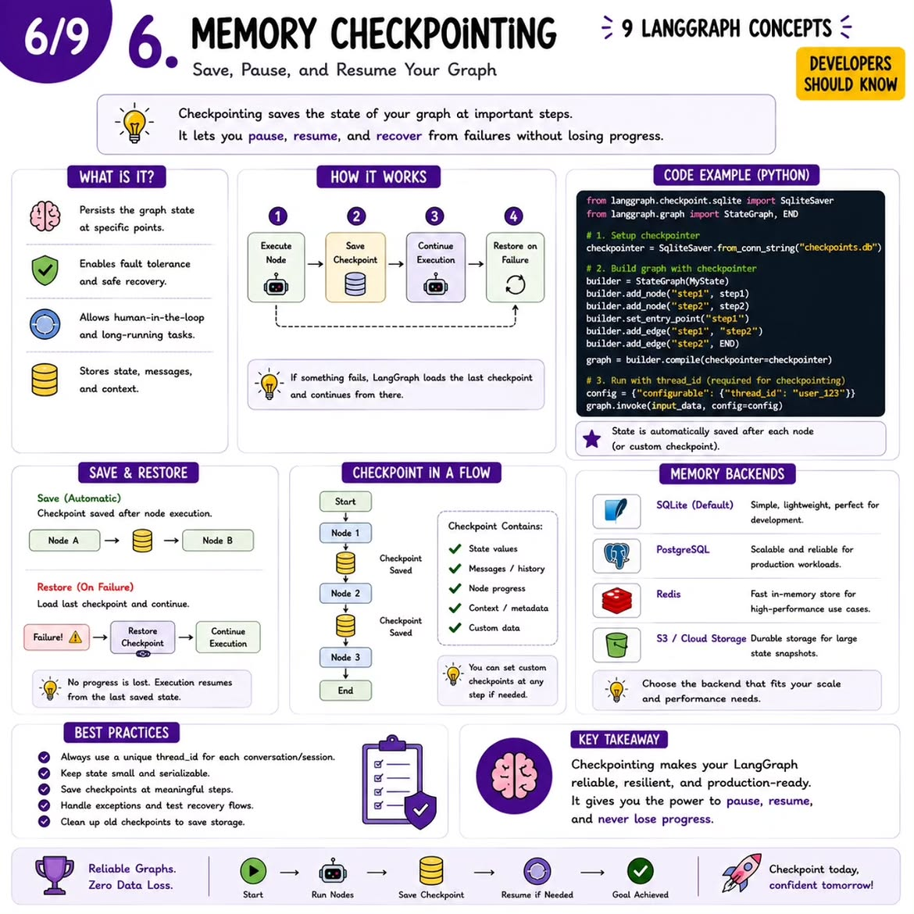

Checkpointing stores graph state so workflows can be resumed, inspected, or recovered. It is useful for multi-turn conversations and longer workflows but is not required to understand the current short-lived reservation graph.

---

## 9. Human-in-the-loop

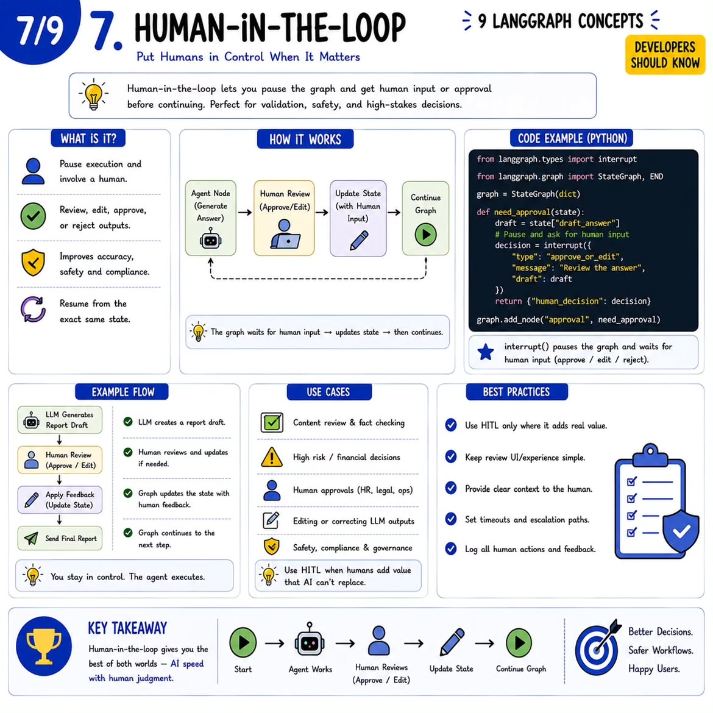

Human-in-the-loop execution can pause a graph and wait for user or operator input. The current project already uses a lightweight version of this idea by stopping when context is missing or ambiguous. A future version could persist the graph and resume after clarification.

---

## 10. Streaming

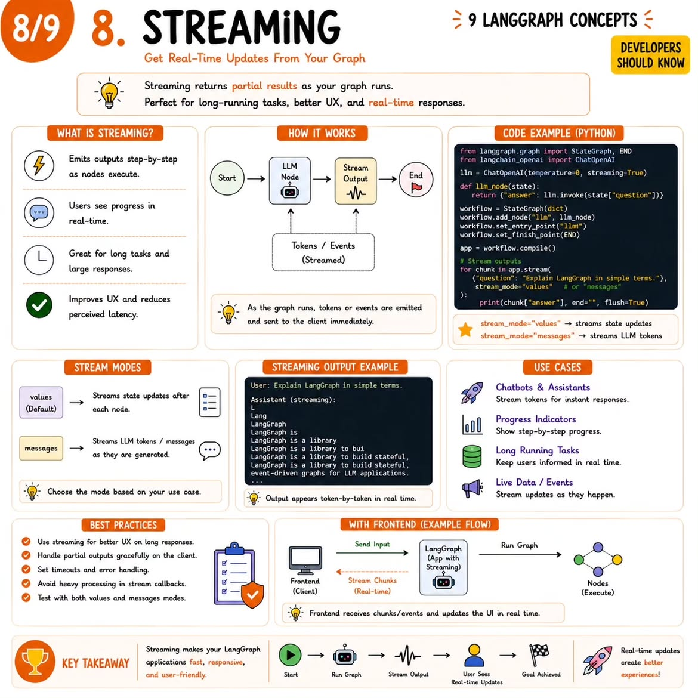

Streaming exposes intermediate events or partial output while the graph is running. It is mainly a user-experience feature for a chat UI or API client and does not change the basic graph model.

---

## 11. Persistence and durable execution

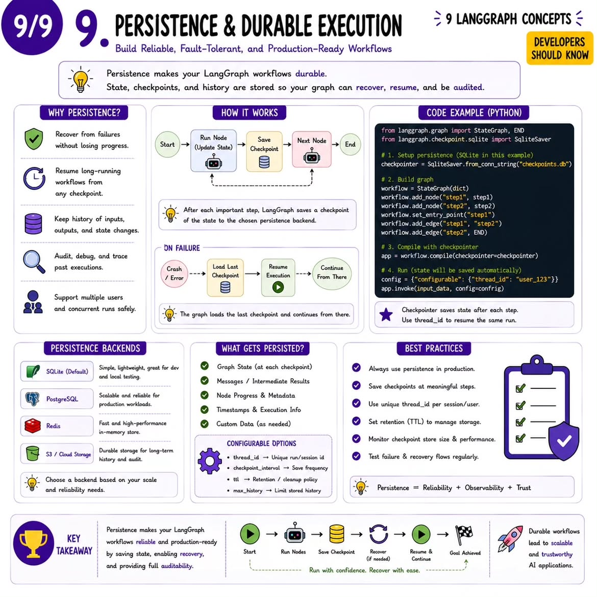

Durable execution makes long-running workflows recoverable across interruptions. This is an advanced production topic rather than a prerequisite for the current project.

---

## Recommended learning order

Focus first on:

1. State
2. Nodes
3. Edges
4. Conditional edges
5. `START` / `END`
6. `StateGraph`
7. `compile()`
8. `invoke()`

Then return to the project and trace this exact sequence:

```text
invoke()
 -> extract_node()
 -> _after_extract()
 -> validate_node()
 -> _after_validate()
 -> resolve_node()
 -> _after_resolve()
 -> analytics_node()
```

After that, learn tools, checkpointing, human-in-the-loop, streaming, and persistence only when you need them.

## Project Discussion summary

> We use LangGraph as the orchestration layer for the reservation analytics agent. It first extracts a structured request and separates knowledge questions from analytics questions. Knowledge questions go to RAG. Analytics questions go through explicit context validation and campaign resolution before reaching the analytics service. Conditional edges make routing, clarification, and stopping conditions deterministic and easy to inspect.

## Files

- `langgraph_project_learning.ipynb` — executable, chapter-by-chapter learning notebook.
- `README.md` — compact reference guide.
- `images/` — one visual per LangGraph concept plus the project workflow diagram.
