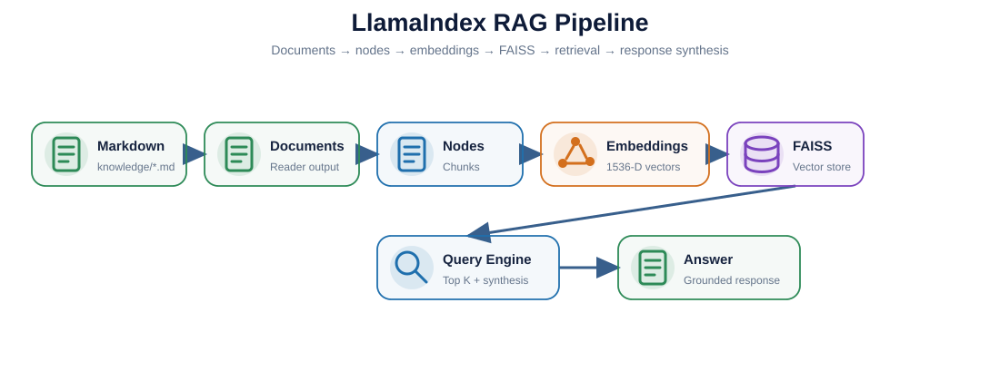

# LlamaIndex Learning — Project-Focused Deep Dive

> Notebook: `llamaindex_project_learning.ipynb`

This folder explains the **knowledge RAG layer** used in the Reservation Analytics AI Agent.

---

## 1. What You Will Learn

After finishing this notebook you should understand:

- what LlamaIndex is;
- `Document`;
- Node / chunk;
- `SimpleDirectoryReader`;
- embeddings;
- `VectorStoreIndex`;
- `StorageContext`;
- vector stores;
- retriever vs query engine;
- `similarity_top_k`;
- response synthesis;
- how FAISS fits underneath LlamaIndex;
- how this project loads its Markdown knowledge;
- how to debug a poor RAG answer;
- production improvements such as persistence, metadata filtering and reranking.

---

## 2. Architecture




---

## 3. Where LlamaIndex Is Used

Current code:

```text
app/knowledge/rag.py
```

Knowledge sources:

```text
knowledge/
├── kg_data_model.md
└── kg_reservation_metrics.md
```

Runtime flow:

```text
Markdown files
      ↓
SimpleDirectoryReader
      ↓
Documents / Nodes
      ↓
OpenAIEmbedding
      ↓
FAISS Vector Store
      ↓
VectorStoreIndex
      ↓
Query Engine
      ↓
Top 3 relevant chunks
      ↓
OpenAI LLM
      ↓
Grounded answer
```

---

## 4. What LlamaIndex Answers

Examples:

```text
What is the Reservation Data Mart grain?

What does reserved but not ordered mean?

How is conversion rate defined?

What does fcountry_code represent?
```

These are **knowledge questions**.

LlamaIndex should not be used to invent actual business counts such as:

```text
How many users reserved CMP001?
```

That question should go to the analytics SQL path.

---

## 5. Core Objects

| Object | Meaning |
|---|---|
| `Document` | A loaded source document |
| `Node` | A smaller retrieval unit / chunk |
| `Embedding` | Numeric semantic representation |
| `VectorStoreIndex` | LlamaIndex index abstraction |
| `StorageContext` | Storage configuration and adapters |
| `Retriever` | Finds relevant nodes |
| `QueryEngine` | Retrieval + answer generation |

---

## 6. Current Project Code

```python
documents = SimpleDirectoryReader(
    input_dir=str(settings.knowledge_dir),
    required_exts=[".md"],
).load_data()

vector_store = FaissVectorStore(
    faiss_index=faiss.IndexFlatL2(1536)
)

storage = StorageContext.from_defaults(
    vector_store=vector_store
)

index = VectorStoreIndex.from_documents(
    documents,
    storage_context=storage,
)

engine = index.as_query_engine(
    similarity_top_k=3
)
```

---

## 7. Top K

Current value:

```python
similarity_top_k=3
```

Meaning:

```text
Question
   ↓
Retrieve 3 most relevant chunks
   ↓
Send all 3 as context to the LLM
   ↓
Generate one answer
```

It is **not voting**.

Why not `top_k=1`?

- may miss supporting context.

Why not `top_k=30`?

- more noise;
- higher token usage;
- weaker context quality.

---

## 8. Retriever vs Query Engine

### Retriever

```text
Question → relevant nodes
```

### Query Engine

```text
Question
   ↓
Retriever
   ↓
Relevant nodes
   ↓
LLM synthesis
   ↓
Answer
```

For RAG debugging, inspect retrieval first.

If retrieval is wrong, changing only the final generation prompt usually does not fix the root cause.

---

## 9. Production Improvements

Current version is deliberately small and easy to learn.

Possible upgrades:

- explicit chunk size / overlap;
- persisted vector index;
- incremental knowledge refresh;
- metadata filters;
- hybrid keyword + vector retrieval;
- reranking;
- retrieval evaluation dataset;
- source citations;
- tracing of retrieved nodes;
- latency and token-cost metrics.

---

## 10. Project-Level Q&A

### Q1. Why LlamaIndex?

It provides a focused abstraction for external knowledge ingestion, indexing, retrieval and response synthesis.

### Q2. LlamaIndex vs FAISS?

LlamaIndex manages the RAG workflow. FAISS only performs vector similarity search.

### Q3. LlamaIndex vs LangGraph?

LlamaIndex handles knowledge retrieval. LangGraph controls the application workflow and routing.

### Q4. Why not query the Data Mart with RAG?

RAG is not the authoritative mechanism for current numeric results. SQL should calculate trusted numbers directly from the Data Mart.

### Q5. How do you debug RAG?

Check:

```text
source document
→ chunking
→ embedding
→ retrieved nodes
→ top K
→ prompt / synthesis
```

---

## 11. After You Finish

You should be able to explain:

> LlamaIndex is the knowledge layer. It loads approved Markdown business definitions, creates a vector-backed index using FAISS, retrieves the most relevant chunks and gives them to the LLM to produce a grounded answer.

Next:

```text
../faiss/
../langgraph/
```

---

## Classic Architecture Q&A

### Q. Why do you use LangChain selectively instead of making it the entire application framework?

> I use LangChain selectively rather than making it the entire application framework. LangChain's ChatOpenAI integration handles structured extraction, LangGraph handles stateful workflow orchestration, and LlamaIndex with FAISS handles the knowledge RAG layer. This keeps responsibilities explicit and prevents the LLM from directly controlling analytics SQL.


### How to remember it

```text
LangChain / ChatOpenAI
→ Structured Extraction

Pydantic
→ Typed Contract

LangGraph
→ Stateful Workflow Orchestration

LlamaIndex + FAISS
→ Knowledge RAG

Controlled Python / SQL
→ Trusted Analytics

FastAPI
→ HTTP Serving
```

### Key design principle

> **Use the best-fitting abstraction for each responsibility instead of forcing every layer into one framework.**

This answer is useful when explaining:

- why the project uses several AI libraries;
- why LangChain is present but not dominant;
- why LangGraph controls routing;
- why LlamaIndex + FAISS own the knowledge path;
- why analytics SQL remains application-controlled.
