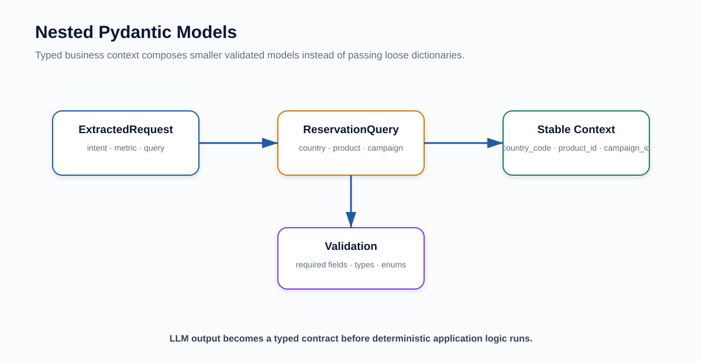

# Pydantic Learning — Project-Focused Deep Dive

> Notebook: `pydantic_project_learning.ipynb`

Pydantic is the **typed contract layer** of this project.

---

## 1. What You Will Learn

- `BaseModel`;
- type annotations;
- optional fields;
- `Literal`;
- nested models;
- `Field`;
- `default_factory`;
- validation errors;
- custom validators;
- `model_dump()`;
- `model_validate()`;
- Pydantic vs `TypedDict`;
- Pydantic with FastAPI;
- Pydantic with LLM Structured Output;
- the project's actual models.

---

## 2. Architecture




---

## 3. Why Pydantic Matters in an LLM Application

LLMs naturally produce flexible text.

Application code needs predictable structure.

Pydantic creates the boundary:

```text
Natural language
      ↓
LLM
      ↓
Pydantic Schema
      ↓
Validated Python object
      ↓
Application logic
```

This is especially important before:

- workflow routing;
- business-rule validation;
- SQL execution.

---

## 4. Current Project Models

File:

```text
app/core/models.py
```

Main models:

```text
ReservationQuery
ExtractedRequest
Campaign
AgentState
```

But note:

```text
ReservationQuery  → Pydantic BaseModel
ExtractedRequest  → Pydantic BaseModel
Campaign          → Pydantic BaseModel
AgentState        → TypedDict
```

---

## 5. ReservationQuery

Purpose:

> Hold business filters extracted from the natural-language question.

Examples:

```python
country
country_code
product
campaign_id
campaign_name
campaign_month
campaign_year
```

Fields are optional because the user may omit context.

Missing input should remain missing:

```python
None
```

It should not be invented by the LLM.

---

## 6. ExtractedRequest

Purpose:

> Standard contract between the LLM extraction layer and LangGraph.

Example:

```python
class ExtractedRequest(BaseModel):
    intent: Literal["knowledge", "analytics"]
    metric: str = "summary"
    detail_requested: bool = False
    query: ReservationQuery = Field(
        default_factory=ReservationQuery
    )
```

This ensures `intent` cannot silently become an unknown routing label.

---

## 7. model_dump()

Example:

```python
request.query.model_dump()
```

Why?

LangGraph `AgentState` is dict-like.

So:

```text
Pydantic object
     ↓
model_dump()
     ↓
dict
     ↓
AgentState
```

---

## 8. Pydantic vs TypedDict

| Pydantic BaseModel | TypedDict |
|---|---|
| Runtime validation | Mainly static typing |
| Parsing | No parsing |
| Validation errors | No runtime validation by itself |
| Serialization helpers | Normal dict |
| Good for external boundaries | Good for internal state shape |

This project uses both appropriately.

---

## 9. Pydantic + LangChain

Current extractor concept:

```python
ChatOpenAI(...).with_structured_output(
    ExtractedRequest
)
```

The model is asked to produce an object that matches your Pydantic schema.

This is one of the cleanest ways to constrain LLM output.

---

## 10. Pydantic + FastAPI

Example:

```python
class AskRequest(BaseModel):
    question: str
```

FastAPI automatically validates request JSON against the model.

---

## 11. Production Improvements

Potential schema improvements:

- stricter enum/`Literal` for supported metrics;
- date types rather than raw strings where needed;
- additional business validators;
- versioned request/response contracts;
- explicit response models;
- strict mode where appropriate.

Do not over-validate fields that belong to database/business resolution rather than syntax/schema validation.

---

## 12. Project-Level Q&A

### Q1. Why use Pydantic?

To turn LLM/API input into validated typed objects before business logic runs.

### Q2. Why not use only dictionaries?

Dictionaries do not give the same runtime contract, validation and discoverability.

### Q3. Why is `AgentState` a TypedDict instead?

It is internal graph state. It mainly needs a documented dict shape rather than repeated parsing/validation at every node.

### Q4. Why use `Literal` for intent?

To constrain valid workflow routes.

### Q5. Why keep missing fields as `None`?

Because the application should ask for clarification rather than guess missing business context.

---

## 13. After You Finish

You should understand the complete type flow:

```text
HTTP request / User text
        ↓
Pydantic schema
        ↓
LLM Structured Output
        ↓
Validated object
        ↓
model_dump()
        ↓
LangGraph AgentState
```

Next:

```text
../langchain/
../langgraph/
```

---

## Classic Architecture Q&A

### Q. Why do you use LangChain selectively instead of making it the entire application framework?

> I use LangChain selectively rather than making it the entire application framework. LangChain's ChatOpenAI integration handles structured extraction, LangGraph handles stateful workflow orchestration, and LlamaIndex with FAISS handles the knowledge RAG layer. This keeps responsibilities explicit and prevents the LLM from directly controlling analytics SQL.


### How to remember it

```text
LangChain / ChatOpenAI
→ Structured Extraction

Pydantic
→ Typed Contract

LangGraph
→ Stateful Workflow Orchestration

LlamaIndex + FAISS
→ Knowledge RAG

Controlled Python / SQL
→ Trusted Analytics

FastAPI
→ HTTP Serving
```

### Key design principle

> **Use the best-fitting abstraction for each responsibility instead of forcing every layer into one framework.**

This answer is useful when explaining:

- why the project uses several AI libraries;
- why LangChain is present but not dominant;
- why LangGraph controls routing;
- why LlamaIndex + FAISS own the knowledge path;
- why analytics SQL remains application-controlled.
